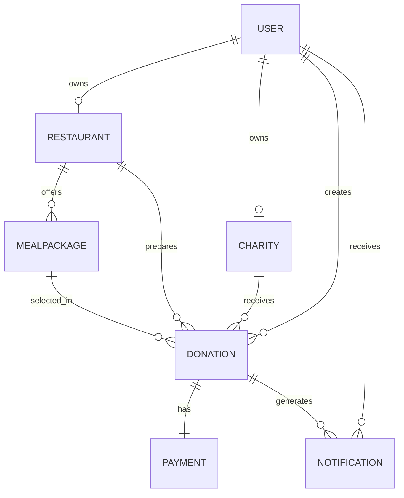

# FoodForward Initial Database Plan

This is the first database design draft for implementation. It may change after the literature review and proposed-solution feedback.

## Main Entities

### User
Stores login and common account information.
- id
- full_name
- email
- password
- role
- is_active

### Restaurant
Stores restaurant details and approval status.
- id
- user_id
- restaurant_name
- address
- contact_number
- is_approved

### Charity
Stores charity details, demand information, and approval status.
- id
- user_id
- charity_name
- address
- contact_number
- demand_level
- capacity
- is_approved

### MealPackage
Stores donation meal packages created by restaurants.
- id
- restaurant_id
- package_name
- description
- meal_quantity
- price
- is_available

### Donation
Stores the main donation transaction.
- id
- donor_id
- restaurant_id
- charity_id
- meal_package_id
- allocation_mode
- total_amount
- status
- created_at

### Payment
Stores simulated payment information for the academic prototype.
- id
- donation_id
- transaction_reference
- amount
- payment_status

### Notification
Stores status updates sent to users.
- id
- user_id
- donation_id
- message
- is_read
- created_at

## Initial Relationships

## First Implementation Order
1. User and role handling.
2. Restaurant and Charity profiles.
3. MealPackage.
4. Donation and status tracking.
5. Payment simulation.
6. Notifications.
